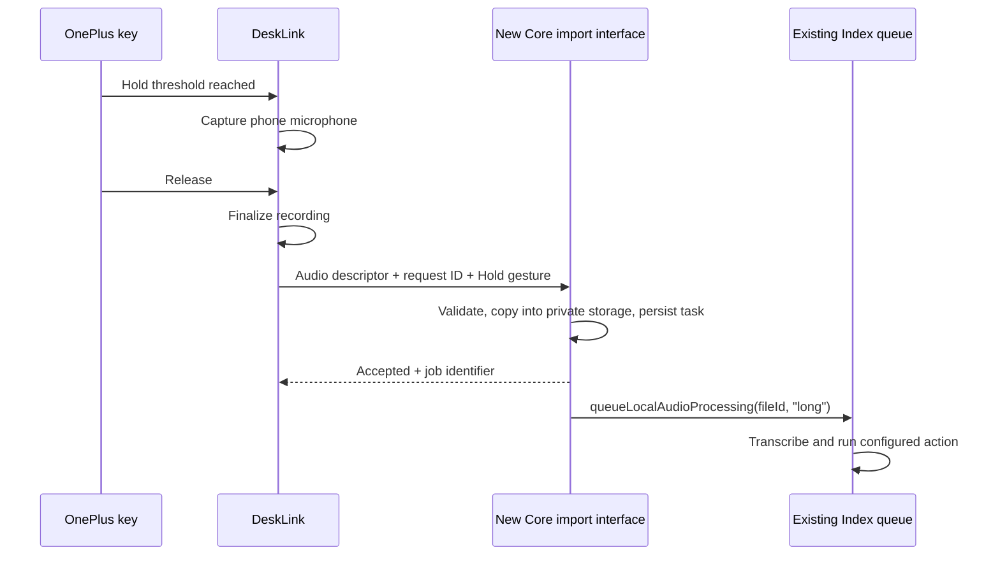

# Plus Key integration with Pebble Index 01

Research date: 2026-09-13. Core source inspected: [`40ea15c8e7c7423bdff995ed4be6bd70dda633a4`](https://github.com/coredevices/mobileapp/commit/40ea15c8e7c7423bdff995ed4be6bd70dda633a4), committed 2026-09-09. DeskLink findings refer to the current working tree. This is a source investigation and implementation proposal; no recording was initiated, APK installed, or runtime integration tested.

## Finding

The integration is feasible. Core already has a phone-microphone recording path feeding Index's processing queue, and an Android deep link that opens a recorder. However, the inspected app does not expose the complete external start/stop or audio-import interface needed for DeskLink's hold-to-record, release-to-process behavior.

Recommended implementation: add an **Index** destination to DeskLink's Plus Key settings, capture the phone microphone in DeskLink, and deliver each completed recording to a small import interface added to Core's app. Core then performs its own transcription, agent processing, and configured actions. This requires a Core app change, initially a custom build or an upstream contribution.

Scope assumption: the OnePlus key substitutes for the ring's capture gesture using the phone microphone. This proposal does not remotely activate the physical ring microphone. The local-audio processing entry point does not require a ring transfer ID; availability still depends on the installed app's Index setup and configured processing services.

## What the existing app exposes

| Entry point | Observed behavior | Fit for this feature |
| --- | --- | --- |
| `ACTION_VIEW`, `voiceapp://listen` | Opens `ListenDialog`, which starts phone recording | Useful starting point, but lacks external stop/submit |
| `ShareToIndexNoteActivity`, `ACTION_SEND`, `text/plain` | Creates a note through the configured note provider | Text-only fallback; DeskLink would need its own transcription |
| `ShareToIndexReminderActivity`, same text contract | Creates a reminder and parses its time | Text-only fallback, not general Index audio processing |
| Debug WAV import in Index's UI | Imports audio and queues processing | Manual proof-of-concept path; not an external automation API |
| `queueLocalAudioProcessing(fileId, buttonSequence)` | Processes a file already stored inside Core | Correct internal target for a new bridge |

### Existing recorder deep link

The Android application ID is `coredevices.coreapp`. Its exported MainActivity accepts the `voiceapp` scheme. [`RingRoutes.kt`](https://github.com/coredevices/mobileapp/blob/40ea15c8e7c7423bdff995ed4be6bd70dda633a4/experimental/src/commonMain/kotlin/coredevices/ring/ui/navigation/RingRoutes.kt#L120-L126) registers `voiceapp://listen`; [`VoiceWidget.kt`](https://github.com/coredevices/mobileapp/blob/40ea15c8e7c7423bdff995ed4be6bd70dda633a4/experimental/src/androidMain/kotlin/coredevices/ring/glance/VoiceWidget.kt) uses that same URI. The widget is disabled by default, but the URI is registered independently.

An app-side launch would be:

```kotlin
val intent = Intent(Intent.ACTION_VIEW, Uri.parse("voiceapp://listen"))
    .setPackage("coredevices.coreapp")
    .addFlags(Intent.FLAG_ACTIVITY_NEW_TASK)
context.startActivity(intent)
```

This is source-backed launch syntax, not a verified end-to-end solution. Handle a missing app, and use package visibility declarations when checking availability. Core must already have microphone permission: this recorder checks it and reports an error instead of requesting it.

The critical limitation is visible in [`ListenDialog.kt`](https://github.com/coredevices/mobileapp/blob/40ea15c8e7c7423bdff995ed4be6bd70dda633a4/experimental/src/commonMain/kotlin/coredevices/ring/ui/dialog/ListenDialog.kt): entry calls `beginManualRecording()`, but the **Finish** button is conditional on `isIOS`. Dismissal calls `cancelManualRecording()`. [`ListenDialogViewModel.kt`](https://github.com/coredevices/mobileapp/blob/40ea15c8e7c7423bdff995ed4be6bd70dda633a4/experimental/src/commonMain/kotlin/coredevices/ring/ui/viewmodel/ListenDialogViewModel.kt) has an internal `completeManualRecording()` that stops capture and allows queueing; the inspected Android entry points do not expose it. The Android recorder has no silence-based automatic completion. Therefore, neither key release nor a second deep-link launch can be assumed to finish and process a recording. Treat this route as incomplete on Android until tested and fixed.

### Sharing text is a different operation

The two exported share activities are disabled by default and enabled by `RingDelegate` when `CoreConfig.enableIndex` is true. They read `Intent.EXTRA_TEXT`, not `EXTRA_STREAM`. [`ShareActionHandler`](https://github.com/coredevices/mobileapp/blob/40ea15c8e7c7423bdff995ed4be6bd70dda633a4/experimental/src/commonMain/kotlin/coredevices/ring/agent/ShareActionHandler.kt) calls the note/reminder integrations directly, bypassing audio transcription and the general recording-agent pipeline. A returned activity or success toast is not an acknowledged processing result.

Sources: [share manifest](https://github.com/coredevices/mobileapp/blob/40ea15c8e7c7423bdff995ed4be6bd70dda633a4/experimental/src/androidMain/AndroidManifest.xml), [share activity](https://github.com/coredevices/mobileapp/blob/40ea15c8e7c7423bdff995ed4be6bd70dda633a4/experimental/src/androidMain/kotlin/coredevices/ring/ShareToIndexActivity.kt), [runtime enablement](https://github.com/coredevices/mobileapp/blob/40ea15c8e7c7423bdff995ed4be6bd70dda633a4/experimental/src/androidMain/kotlin/coredevices/ring/RingDelegate.android.kt).

Tasker and Index webhooks in this source send Index results outward. They do not supply an incoming record/process endpoint. The internal `pebblecore://index-link/...` actions operate on existing recording IDs. Generic content-view filters in MainActivity do not establish an audio import contract.

## The processing seam to reuse

The maintained phone recorder in [`IndexComposeBarHost.kt`](https://github.com/coredevices/mobileapp/blob/40ea15c8e7c7423bdff995ed4be6bd70dda633a4/experimental/src/commonMain/kotlin/coredevices/ring/ui/components/chat/IndexComposeBarHost.kt#L59-L121) demonstrates the required storage lifecycle:

1. Capture into `RecordingStorage.openOriginalRecordingSink(...)`.
2. Stop capture and wait for the writer to finish.
3. Copy the original PCM into `openRecordingSink(...)` as the initial processed version.
4. Call `RecordingProcessingQueue.queueLocalAudioProcessing(...)`.

The queue persists a local-audio task, creates a recording entry, runs preprocessing, resolves a recording operation, and executes it. Unlike ring transfer processing, this path accepts no BLE transfer ID. The internal call is:

```kotlin
recordingQueue.queueLocalAudioProcessing(
    fileId = importedFileId,
    buttonSequence = "long",
)
```

`"long"` matters: it maps to `RingGesture.Hold` and follows the user's **Hold & Talk** destination. Passing `null`, as the phone UI currently does, falls back to the Index agent; it does not necessarily follow a customized Hold route. `"short long"` maps to Click & Hold if a second recording gesture is added later. Those are Core's sequence strings, not Android keycodes.

Sources: [queue](https://github.com/coredevices/mobileapp/blob/40ea15c8e7c7423bdff995ed4be6bd70dda633a4/experimental/src/commonMain/kotlin/coredevices/ring/service/recordings/RecordingProcessingQueue.kt#L600-L614), [sequence parser](https://github.com/coredevices/mobileapp/blob/40ea15c8e7c7423bdff995ed4be6bd70dda633a4/experimental/src/commonMain/kotlin/coredevices/ring/service/IndexButtonSequenceRecorder.kt), [gesture definitions](https://github.com/coredevices/mobileapp/blob/40ea15c8e7c7423bdff995ed4be6bd70dda633a4/experimental/src/commonMain/kotlin/coredevices/ring/service/button/RingGestureRouting.kt), [routing fallback](https://github.com/coredevices/mobileapp/blob/40ea15c8e7c7423bdff995ed4be6bd70dda633a4/experimental/src/commonMain/kotlin/coredevices/ring/service/button/GestureRoutingPreferences.kt), [operation factory](https://github.com/coredevices/mobileapp/blob/40ea15c8e7c7423bdff995ed4be6bd70dda633a4/experimental/src/commonMain/kotlin/coredevices/ring/service/recordings/button/RecordingOperationFactory.kt).

For an initial bridge, standardize on mono, signed little-endian PCM16 at 16 kHz, matching [Core's Android recorder](https://github.com/coredevices/mobileapp/blob/40ea15c8e7c7423bdff995ed4be6bd70dda633a4/experimental/src/androidMain/kotlin/coredevices/ring/util/AudioRecorder.android.kt). DeskLink currently captures at 48 kHz, optionally selecting one stereo channel for its top microphone setting. Preserve that capture path and resample correctly, or separately validate native 16 kHz capture. Do not relabel 48 kHz bytes as 16 kHz.

Core's storage sinks hold raw PCM plus metadata. If exchanging WAV files, parse the RIFF chunks and copy the PCM payload; do not write the WAV header into the raw sink. The [debug importer](https://github.com/coredevices/mobileapp/blob/40ea15c8e7c7423bdff995ed4be6bd70dda633a4/experimental/src/commonMain/kotlin/coredevices/ExperimentalDevices.kt#L151-L167) assumes a 44-byte header and 16 kHz, so it is only a limited prototype aid. Preserve both original and processed files, as [preprocessing](https://github.com/coredevices/mobileapp/blob/40ea15c8e7c7423bdff995ed4be6bd70dda633a4/experimental/src/commonMain/kotlin/coredevices/ring/service/recordings/RecordingPreprocessor.kt) reads the original.

## Proposed implementation



All bridge methods, acknowledgments, and job identifiers above are proposed additions, not APIs present in Core today.

**DeskLink changes:**

- Add a persisted `PC / Index` selection to `PlusKeyPreferences.kt` and the Plus Key card. Keep PC as the migration default.
- Route the existing `PlusKeyGestures` results through a destination dispatcher. `OplusLogKey.dispatch()` currently gates holds on a live `RemoteClient` session; Index needs a separate local capture session and no PC requirement.
- Move capture ownership out of the PC-specific gate, or create an Index recording service that shares the existing key reader. `MicrophoneService` currently requires `connected && audioReady`; `MainActivity` also prepares it only after connecting. Both lifecycles need a local mode.
- Keep microphone capture exclusive between PC and Index. Snapshot the destination for each hold, release any held PC chord when changing mode, and never send PC tap shortcuts from Index mode. Use quick taps as no-ops initially.
- Finalize audio on release, retain the existing maximum-hold/fault cleanup behavior, and make retries idempotent. Add temporary-file cleanup after acknowledgment and bounded retention for failed delivery. Index mode introduces stored recordings, unlike the current PC stream.

**Core changes:**

- Add a versioned, explicitly enabled import interface. A bound Android service accepting a `ParcelFileDescriptor` is a suitable design for delivery without launching a screen. Authenticate the calling UID against a user-approved package/signing identity; do not trust a package name passed in an extra. A content URI with narrowly scoped read permission is another possible transport.
- Validate encoding, size, duration, gesture, and request ID, copy into Core's private storage, and persist the processing task before acknowledging acceptance. Keep acceptance distinct from successful transcription/action completion.
- Reuse the existing queue and its background execution arrangements. Test cold starts and process death: merely launching a coroutine in a short-lived receiver is insufficient. Core's inference boost service attempts background starts and catches failures, so background completion needs device evidence.
- Return clear unavailable/setup-required states when Index or its configured processor is not ready. The existing local queue returns `Unit`; obtaining a stable external job/result handle is additional work.

### Smaller alternative

If foreground-only use is acceptable, extend Core's existing recorder with explicit start/stop/cancel commands, a session ID, an Android Finish control, and a recording controller whose lifetime survives navigation. DeskLink could then forward key edges and let Core own the microphone. This changes less audio code, but requires reliable app launch and lifecycle handling. The existing `voiceapp://listen` URI alone does not implement this protocol.

For the existing screen-off Plus Key experience, capturing in DeskLink and importing the finished clip is the stronger design. Start/arm the microphone foreground service from a visible, user-initiated setup action. Android restricts both [background activity launches](https://developer.android.com/guide/components/activities/secure-bal) and [starting microphone foreground services from the background](https://developer.android.com/develop/background-work/services/fgs/restrictions-bg-start). A logcat-observed hardware press does not by itself establish an exemption. A foreground service notification is not permission to open another app's activity whenever the key is pressed.

## Validation before enabling the mode

1. Check the installed Core version against this source. Its [README](https://github.com/coredevices/mobileapp/blob/40ea15c8e7c7423bdff995ed4be6bd70dda633a4/README.md) says the public repository is a manually synchronized mirror and can lag internal development. Confirm Index setup, microphone permission, and configured model/service availability.
2. Verify a generated, known-format audio fixture can be imported and queued once, including `long` routing. Then verify real speech through the phone microphone.
3. Verify hold/release, quick taps, maximum duration, missing release, mode change mid-hold, and reader failure. Confirm no PC shortcut or PC microphone packet leaks into Index mode.
4. Test with no PC connected, DeskLink visible, another app visible, screen locked, Core initially stopped, and process death before/after acceptance. Exercise the two apps' real signing identities and package visibility.
5. Verify missing Core app, disabled Index, missing models, offline processing where supported, rejected input, duplicate delivery, audio-file cleanup, and clear distinction between accepted/processing/completed/failed.

No physical-device behavior, current store-build support, or background delivery guarantee is established by this research. Only this research document was added to DeskLink; application implementation remains unchanged by this task.
